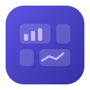

<p align="center">
  
</p>

<h1 align="center">Sillview</h1>

<p align="center">
  <strong>A desktop dashboard for your financial ledger.</strong>
</p>

<p align="center">
  <a href="https://github.com/paulmeier/sillview/actions/workflows/ci.yml"></a>
  <a href="https://github.com/paulmeier/sillview/actions/workflows/release-please.yml"></a>
  <a href="https://github.com/paulmeier/sillview/releases/latest"></a>
  <a href="https://paulmeier.github.io/sillview/"></a>
  <a href="LICENSE"></a>
</p>

---

Sillview is a **macOS desktop app** that turns the
[**kasas**](https://github.com/paulmeier/kasas) financial ledger into a dashboard
you can actually look at. Build your own dashboards from a **marketplace of
widgets**, arrange them on a **draggable, resizable grid**, and save them locally.

The defining trait: Sillview **bundles and manages the kasas backend for you** —
there's no separate server to install or run. On first launch it starts kasas on a
private loopback port, connects automatically, and can keep it running in the
background and update it in place.

Built with **Electron Forge + Vite + React 19 + TypeScript**, styled with
**Tailwind CSS v4**, and visualized with **Tremor**-style charts (Recharts).

## Features

- **Custom dashboards** — arrange widgets on a draggable, resizable grid and save
  as many dashboards as you like; they persist locally on your machine.
- **Widget marketplace** — browse a catalog by category (net worth, accounts, cash
  flow, spending, live activity) and drop widgets onto a dashboard.
- **Managed backend** — Sillview ships the kasas binary, generates its config,
  starts it on loopback, and connects automatically. No separate server to run.
- **Background mode** — opt in to a macOS LaunchAgent that keeps kasas syncing even
  when Sillview is closed, so your data stays fresh.
- **In-app backend updates** — drive kasas's own verified self-update (HTTPS +
  SHA-256 + atomic replace) and restart it in one click.
- **Offline mock mode** — run the entire UI on in-memory fixtures: no backend, no
  network, no real data.

## Quick start

```bash
npm install
npm run sync:kasas   # build the kasas binary and bundle it (needs ../kasas + Go 1.25)
npm start            # build + launch the app (dev)
```

On first launch Sillview copies the bundled binary into its data dir, generates a
`config.toml` (with a random dashboard token), starts kasas on
`http://127.0.0.1:8080`, and connects automatically.

Open **Settings** (gear at the bottom of the sidebar) to switch between the
**Bundled** backend and an **External** kasas URL, set the **poll interval**,
toggle **Background mode**, and watch process **status** and live logs.

Configure data sources (SimpleFIN, exchange addresses, etc.) for now via kasas's
own web UI at `http://127.0.0.1:8080`; in-app source setup is a planned follow-up.

### Offline / mock mode

To work on the UI without kasas, a connection, or any of your own data:

```bash
npm run start:mock   # KASAS_MOCK=1 — serve fixtures, no backend
```

The main process answers every REST call from in-memory fixtures
(`src/main/kasas/mock.ts`), skips the kasas binary, and feeds the live stream
synthetic events. The dataset (accounts, ~6 months of transactions, labels, a sync
run) is generated relative to "now" so every widget has data.

### Other scripts

```bash
npm run package    # build an unpackaged .app
npm run make       # build a distributable (.dmg + .zip on macOS)
npm run typecheck  # tsc --noEmit
```

Code signing / notarization for release builds are wired but disabled; enable them
in `forge.config.ts` using `APPLE_ID` / `APPLE_PASSWORD` / `APPLE_TEAM_ID` env vars
(never inline credentials).

## Architecture

Three process boundaries (`src/main.ts`, `src/preload.ts`, `src/renderer/`):

```
src/
├── main.ts                  # Electron entry: window, CSP, lifecycle
├── main/
│   ├── ipc.ts               # registers IPC handlers; owns the connection + stream
│   ├── kasas/http.ts        # kasas REST broker (Node fetch — no CORS)
│   ├── kasas/sse.ts         # /api/v1/events/stream consumer → forwards to renderer
│   └── storage/             # connection.json + dashboards.json in userData
├── preload.ts               # contextBridge → window.api (the only renderer↔main link)
├── shared/                  # IPC contract + kasas DTO types (used by both sides)
└── renderer/
    ├── api/                 # typed kasas client (over window.api) + React hooks
    ├── store/               # zustand: connection + saved dashboards (persisted)
    ├── components/tremor/   # Tremor-style Card + Recharts charts
    ├── widgets/             # widget components + registry.ts (the marketplace catalog)
    ├── marketplace/         # MarketplacePanel — browse & add widgets
    ├── dashboard/           # DashboardGrid (react-grid-layout) + WidgetHost + ErrorBoundary
    └── App.tsx              # app shell (sidebar, top bar, dialogs)
```

**Two load-bearing decisions:**

1. **All kasas traffic goes through the main process.** kasas sends no CORS
   headers, so a renderer on a `localhost`/`file://` origin can't call it directly.
   Main performs every REST call and the SSE stream with Node `fetch` and exposes a
   narrow, validated `window.api` over `contextBridge`. `contextIsolation`,
   `sandbox`, and `nodeIntegration:false` stay on; the renderer never sees
   `ipcRenderer`.
2. **Dashboards are saved locally.** kasas has no dashboard storage, so the
   renderer's dashboard store (zustand `persist`) writes through IPC to
   `dashboards.json` in the app's userData directory.

**Adding a widget** is one entry in `src/renderer/widgets/registry.ts` (title,
category, icon, default size, component) plus a component file — the registry is the
single source both the marketplace UI and the dashboard engine read.

**kasas data notes:** money (`amount`, `balance`) is a **decimal string in major
units** with variable scale (2 for USD, up to 18 for ETH) — never round it or store
it as a number; formatting lives in `src/renderer/lib/money.ts`. Timestamps are
ISO-8601 strings; `labels` is a flat `{key: value}` map.

## Toolchain notes

- **Tailwind v4** (CSS-first, `@tailwindcss/vite`) — no `tailwind.config.js`.
- **Tremor** is used in its copy-paste/Recharts form rather than the frozen
  `@tremor/react` npm package (which requires Tailwind v3). Components in
  `components/tremor/` follow Tremor's API and can be swapped for official Tremor
  Raw files.
- `vite.renderer.config.mts` is `.mts` on purpose: Forge loads Vite configs in
  CommonJS, but `@tailwindcss/vite` and `@vitejs/plugin-react` are ESM-only.

## Contributing

Run `make` (or `make help`) for one-word commands to install, run, test, and build.
Commits follow [Conventional Commits](https://www.conventionalcommits.org/), and
versioning + releases are automated by
[release-please](https://github.com/googleapis/release-please). See
[CONTRIBUTING.md](CONTRIBUTING.md) for the full local workflow.

Contributors sign a one-time [Contributor License Agreement](CLA.md) — the CLA
Assistant bot prompts you automatically on your first pull request.

## License

Sillview is free and open source under the [MIT License](LICENSE) for personal,
non-commercial, and open-source use.

A [**commercial license**](LICENSE_COMMERCIAL.md) is available for hosted/SaaS or
proprietary commercial use. The MIT license plus a Contributor License Agreement
keep the door open to a formal dual commercial/open-source model later.
