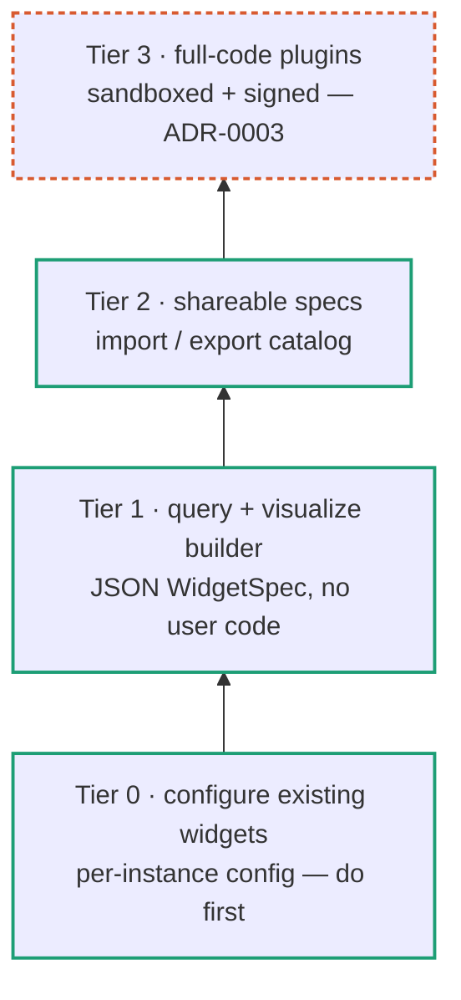

# ADR-0001: User-created widgets — a declarative-first, tiered model

- **Status:** Proposed
- **Date:** 2026-06-12
- **Deciders:** Paul Meier
- **Related:** [ADR-0002](0002-backend-capability-detection-and-plugin-activation.md) ·
  [ADR-0003](0003-third-party-code-widget-sandboxing.md) ·
  [Building a Widget](../../development/building-a-widget.md) ·
  [Widget Catalog](../../features/widgets.md) ·
  [kasas Integration → The CORS broker](../kasas-integration.md#the-cors-broker)

## Context and problem statement

Today every widget is built by a developer. Adding one means
[one catalog entry plus a component file](../../development/building-a-widget.md),
shipped in a release. Users want what Grafana gives them: the ability to **create
their own widgets** — pick data, filter it, choose a chart — without waiting on us
and without writing code.

The current catalog (`src/renderer/widgets/registry.ts`) holds eight widgets, and
they share one revealing shape: each accepts `WidgetProps { instanceId, config? }`
and **ignores both**. Every limit, filter, currency, and chart type is hardcoded
(`useTransactions({ limit: 40 })`, `MONTHS = 6`, `MAX_SLICES = 7`, a dominant-currency
auto-pick). The persisted `WidgetInstance.config?` field already exists in
`src/renderer/store/dashboards.ts` but `addWidget` never writes it — it stores
`{ id, type }` only. So the foundation for user configuration — a per-instance config
bag that round-trips through the existing `dashboards.json` persistence and reaches
the component — **already exists in the type system and is simply unused.**

The question this ADR answers: *what is the shape of "users create widgets" for
Sillview, and in what order do we build it?*

## Decision drivers

- **Declarative-first / "very vanilla."** Prefer data-driven configuration over
  executing user code for as long as it covers the need. Each step up in power must
  earn its added risk.
- **The CORS broker is the security model.** The renderer has no Node and no direct
  network; it reaches kasas only through `window.api.kasas.request()` → main →
  `http.ts`. Anything users author must flow through that broker, never around it.
- **Money is a signed decimal string** in major units with variable scale. The moment
  users can change currency or grouping, aggregation paths that fixed defaults avoid
  become reachable. Decimal-safe math and currency-as-an-axis are correctness
  requirements, not polish.
- **Local persistence.** User widgets are user data; they must serialize into the
  existing `dashboards.json` blob without a new storage backend.
- **Offline dev must keep working.** `KASAS_MOCK=1` serves a fixed route set; a builder
  that mints arbitrary requests must not silently break the backendless workflow.
- **Bounded migration burden.** The instant users author content, we own its backward
  compatibility forever. The design must keep that burden finite.

## Considered options

### Option A — Keep shipping built-in widgets only

Stay as we are; satisfy new needs by adding more developer-built widgets.

- **Good:** zero new architecture; zero new trust surface; nothing to migrate.
- **Bad:** doesn't answer the request at all. Every variation ("same transactions
  list but only Checking") needs a release. Does not scale to user demand.

### Option B — Jump straight to a full plugin SDK (third-party code)

Ship a code-plugin system: users (and a community) write React components against an
SDK and load them at runtime.

- **Good:** maximally powerful; arbitrary visualizations; a potential ecosystem.
- **Bad:** the heaviest possible first step. Introduces a real attacker surface
  (arbitrary JS in our app), demands sandboxing + signing + curation up front, and a
  permanent compatibility and security commitment — most of which a personal-finance
  dashboard never needs. Front-loads the riskiest work before any cheaper value ships.

### Option C — A declarative-first **altitude ladder** (chosen)

Treat "user-created widgets" not as one feature but as a ladder of tiers. Lower rungs
are pure configuration interpreted by trusted first-party code (no user code, minimal
risk); higher rungs add power and risk. Ship bottom-up; defer code execution
([ADR-0003](0003-third-party-code-widget-sandboxing.md)) until a need is proven.

- **Good:** each rung ships standalone value, reuses the rung below, and keeps the
  risk profile flat across the safe tiers. Defers the two expensive commitments —
  user-content migration and third-party-code sandboxing — until they're earned.
- **Bad:** more total surface than Option A; introduces spec versioning and a more
  capable registry; requires discipline to not let the top rung's needs contaminate
  the safe rungs' design.

## Decision outcome

**Adopt Option C.** Build user-created widgets as a four-tier ladder, declarative-first,
shipped bottom-up. This ADR specifies **Tiers 0–2 (no user code)**. Tier 3 (third-party
code) is split into [ADR-0003](0003-third-party-code-widget-sandboxing.md) precisely
because it is a separable, deferrable, security-critical decision that must not bleed
into the design of the safe tiers.



The mental-model correction that justifies stopping the declarative ladder where we do:
**Sillview is not Grafana's full panel editor.** Grafana's power comes from datasource
*query languages* (PromQL/SQL). Sillview has no query language — it has a fixed REST
enumeration of roughly six kasas endpoints. So our builder is Grafana's
*transformations + visualization* panes over a **fixed datasource**: a parameter form,
a transform pipeline, and a chart picker — not a query editor. That ceiling is exactly
what keeps Tiers 1–2 tractable and their migration burden bounded.

## Detailed design

### Tier 0 — Configurable instances of existing widget types (do this first)

The user does not create a new *kind* of widget; they create a *configured instance* of
one. "Transactions, limit 50, Checking only" and "Transactions, limit 20, all accounts"
become two tiles from one catalog entry. This is Grafana's panel-options idea.

What changes:

- **`src/renderer/widgets/types.ts`** — add an optional `configSchema` to
  `WidgetDefinition`: a tiny hand-rolled field descriptor (name → type/enum/default/
  min/max), *not* full JSON Schema. Enough to auto-render a form and validate input.
  Illustrative shape (final form TBD):

  ```ts
  // illustrative — not final
  type ConfigField =
    | { kind: 'number'; key: string; label: string; default?: number; min?: number; max?: number }
    | { kind: 'enum';   key: string; label: string; options: { value: string; label: string }[]; default?: string }
    | { kind: 'account';key: string; label: string }          // resolved against live accounts
    | { kind: 'dateRange'; key: string; label: string }
    | { kind: 'label';  key: string; label: string };         // a kasas label key/value

  interface WidgetDefinition {
    /* …existing fields… */
    configSchema?: ConfigField[];
  }
  ```

- **`src/renderer/store/dashboards.ts`** — change `addWidget(type, size)` to
  `addWidget(type, size, config?)` and persist `{ id, type, config }`. Because `config`
  is already part of the persisted `WidgetInstance`, this round-trips through the
  existing zustand-persist → IPC → `dashboards.json` path with **zero storage changes.**
- **Each widget component** — read `config` and apply it as overrides on today's
  hardcoded defaults (`const limit = config?.limit ?? 40`). The data hooks already key
  on `JSON.stringify(query)`, so config→query is a per-widget one-liner and
  refetch-on-change is free. **Resolve schema defaults at the component/data-hook
  boundary, not in `WidgetHost`** — the host is a synchronous lookup-and-render function
  and must stay ignorant of schema semantics.
- **`src/renderer/marketplace/MarketplacePanel.tsx`** and the dashboard — if a widget
  has a `configSchema`, render an auto-generated form on add; and add an in-place
  **Configure** affordance on existing tiles. This second part is core to Tier 0, not an
  extra: the marketplace currently has *no* edit path (`addWidget(def.type,
  def.defaultSize)` is the only mutation). Re-configuring a placed tile is the difference
  between "a fancier add menu" and "feels like Grafana."

**Correctness rules that land at Tier 0, not later:**

- **Decimal-safe money.** The existing widgets already aggregate decimal-string money
  (net-worth sums per currency, cash-flow splits in/out, spend-by-label groups
  outflows). The instant config lets a user change currency or grouping, those paths run
  on user-chosen inputs. Route all sums through `src/renderer/lib/money.ts`; never
  `Number()` a money string to add it.
- **Multi-currency is a constraint, not formatting.** Every chart widget collapses to a
  dominant currency today *because mixed-currency sums are meaningless*. Any config that
  regroups data must keep currency as a filter or an axis, or aggregates will silently
  add EUR to USD.

### Tier 1 — A generic Query + Visualize builder

One new built-in type, `query-builder`, whose behavior is driven by a JSON **WidgetSpec**
the user composes in a builder UI. A `query-builder` instance is just a Tier 0 widget
whose `config` is a full spec — so it reuses Tier 0's persistence and host plumbing
entirely. Still **no user code**: everything is data interpreted by trusted first-party
renderer code, so the risk class is unchanged from Tier 0.

Illustrative WidgetSpec (final shape is [an open question](#open-questions)):

```ts
// illustrative — not final
interface WidgetSpec {
  version: 1;
  source: {                         // bound to the FIXED kasas endpoint enumeration
    endpoint: 'transactions' | 'accounts' | 'balances' | 'labels' | 'sync' /* … */;
    query: { limit?: number; accountId?: string; since?: string; until?: string;
             labelKey?: string; labelValue?: string };   // a path + query only — never a host
  };
  transform?: {                     // a small, fixed pipeline — not a language
    groupBy?: string;
    aggregate?: 'sum' | 'count' | 'avg';
    currency?: string;              // required when aggregating money across rows
    topN?: number;
  };
  viz: {
    kind: 'table' | 'line' | 'bar' | 'stat' | 'pie';
    fields: Record<string, string>; // map result fields → chart channels
  };
  live?: boolean;                   // opt-in refetch on backend events — see below
}
```

Three hard constraints, all from the real architecture:

- **The broker is non-negotiable.** A spec's `source` is compiled into a `KasasRequest`
  routed through `window.api.kasas.request()`. The builder generates only queries the
  existing broker already serves — **no new IPC surface**, and the renderer stays
  incapable of reaching kasas any other way.
- **Specs are hard-constrained to kasas paths.** `kasas.request({ method, path })`
  brokers to any *path* on the configured base URL but cannot set a *host* (`http.ts`
  pins the base via `buildUrl`). The spec therefore carries a `path`/`query`, never a
  host. External egress is *not* available to specs — that is a separate, main-process-
  only, allowlisted capability (see
  [ADR-0002, kind (b)](0002-backend-capability-detection-and-plugin-activation.md#two-plugin-kinds)).
- **Money math is decimal-string-safe**, baked into the builder's aggregate primitives
  once so every spec inherits correct, currency-aware sums.

Two behaviors must be *designed in*, not inherited by accident:

- **Live/SSE is opt-in per spec.** Today live-ness is automatic: hooks re-key on
  `eventNonce` and the activity feed subscribes to `window.api.events.onEvent`. A spec
  needs an explicit `live` flag (ideally with an event-type filter). At scale this
  matters: *N* live specs re-keying on every event is an *N*-refetch fan-out per event —
  coalesce through the existing throttled event tick and state the ceiling plainly.
- **Mock coverage.** Under `KASAS_MOCK=1`, `mock.ts` implements a fixed route set. Either
  constrain the builder's query surface to mock-covered routes/params, or give `mock.ts`
  a generic query handler — but decide it explicitly so offline dev doesn't regress
  silently.

### Tier 2 — Declarative custom widgets (shareable specs)

Tier 1 builds a spec for yourself; Tier 2 makes it a **portable artifact**: a self-
contained JSON manifest (`{ id, title, icon, category, defaultSize, spec, version,
requires? }`) the user can export, import, and share — still no arbitrary code.

- **The registry becomes a resolver, not a static map.** `registry.ts` evolves from a
  literal array into a layered lookup: built-in component types, then user-imported specs
  (loaded at runtime from a `specs/` file in `userData`, beside `dashboards.json`),
  interpreted by the `query-builder` component. Importing a spec adds *data* the existing
  interpreter renders, not code.

  ```mermaid
  flowchart LR
      H["WidgetHost asks resolver for type T"] --> B{"built-in<br/>component?"}
      B -- yes --> RC["render component"]
      B -- no --> S{"imported<br/>spec?"}
      S -- yes --> RS["render via query-builder"]
      S -- no --> P{"requires a<br/>plugin? (ADR-0002)"}
      P -- yes --> GATE["render 'Activate plugin X' tile"]
      P -- no --> MISS["render 'Missing: import/install T' tile"]
  ```

- **The marketplace becomes a catalog** of built-ins plus imported specs, with
  Import/Export.
- **Versioning and migration start here and last forever.** Every saved spec carries a
  `version`; the interpreter needs a `migrate(spec)` step per bump. Decide the spec
  schema carefully *before* shipping import/export — it's the hardest thing to change
  later, and the fixed-datasource ceiling is what keeps that migration bounded.
- **Referential integrity is the portability bug this tier introduces.** Today
  `WidgetHost` renders a generic "Unknown widget: {type}" when a type misses. The moment
  specs are importable (or widgets are plugin-gated), a `dashboards.json` can reference a
  `type` that resolves to nothing on another machine. Two requirements follow:
  (a) `dashboards.json` must either **embed the spec inline** or record a **spec id +
  version + source**; and (b) the resolver must degrade to an **actionable** tile
  ("Missing dependency: import X" / "Requires plugin Y — Activate"), never the generic
  "Unknown widget." This is the same degradation path the plugin gate in ADR-0002 needs.

### Cross-cutting

- **One builder UX** serves Tier 0 (just the field form), Tier 1 (the full query→viz
  pipeline), and Tier 2 (pipeline + export). Build it once against the WidgetSpec model.
- **The resolver is the spine.** `WidgetHost` calls the layered resolver instead of
  indexing a literal map; that single refactor underpins all three tiers and the
  ADR-0002 gate.

## Consequences

### Positive

- Turns eight fixed widgets into an effectively unlimited set of useful tiles at the
  cheapest rung, with no new trust surface.
- Each tier reuses the one below; persistence, the host, and the builder are built once.
- The declarative ceiling keeps the whole thing inside "user config" risk — no code
  execution until ADR-0003 is deliberately chosen.

### Negative / risks

- **You support user content forever.** Every exported spec is a compatibility
  obligation from Tier 2 onward; versioned specs + a migration step are mandatory.
- **Money/multi-currency correctness goes live at Tier 0.** A single `Number()` in an
  aggregate path silently corrupts sums; mixed-currency aggregation must be prevented by
  construction.
- **Live fan-out** is a real scaling wall for many live tiles; mitigated by opt-in `live`
  and coalescing.
- **Complexity creep** if Tier 3's needs are allowed to shape Tiers 0–2. They must not —
  hence the split into ADR-0003.

## Implementation plan

Phased; each phase ships standalone.

- [ ] **Phase 1 — Tier 0.** `configSchema` on `WidgetDefinition`; `addWidget(…, config)`;
      per-widget config reads; auto-form on add; in-place **Configure**; decimal-safe
      money helper and the multi-currency-as-axis rule.
- [ ] **Phase 2 — capability gating** (see
      [ADR-0002](0002-backend-capability-detection-and-plugin-activation.md), Phases 1–2)
      — built in parallel; cheap and forward-compatible.
- [ ] **Phase 3 — Tier 1 builder.** `query-builder` type; WidgetSpec model + interpreter;
      builder UI; decimal-safe + currency-aware aggregation; `live` flag with fan-out
      coalescing; mock-route coverage decision.
- [ ] **Phase 4 — Tier 2 catalog.** Finalize the WidgetSpec schema *first*; layered
      registry resolver; spec import/export; spec versioning + `migrate`; referential-
      integrity degradation (inline/identified specs + actionable missing-dependency
      tiles).
- [ ] **Phase 5 — Tier 3** — only if a novel-visualization need is proven; governed by
      [ADR-0003](0003-third-party-code-widget-sandboxing.md).

## Open questions

1. **How rich must the WidgetSpec be?** Bounded by the fixed ~6-endpoint datasource —
   a parameter form + transform pipeline, not a query language. The more templating we
   allow, the closer to "code" and the harder migration gets. Confirm that ceiling
   before Phase 4.
2. **Curated catalog vs open sharing?** If specs are ever shared beyond a single user,
   curated vs open is a fork with very different trust outcomes (see ADR-0003).
3. **One builder UX for all three declarative tiers** (recommended) — confirm, since it
   determines how much of Tier 1's UI is reused by Tier 0's in-place Configure.

## References

- [Building a Widget](../../development/building-a-widget.md) — the current
  "one entry + a component" model this ADR generalizes.
- [Widget Catalog](../../features/widgets.md) and
  [Dashboards & Widgets](../../features/dashboards.md).
- [kasas Integration → The CORS broker](../kasas-integration.md#the-cors-broker).
- Grafana panel options / field config and dashboards-as-JSON (the
  "configure vs install" boundary this ladder mirrors).
