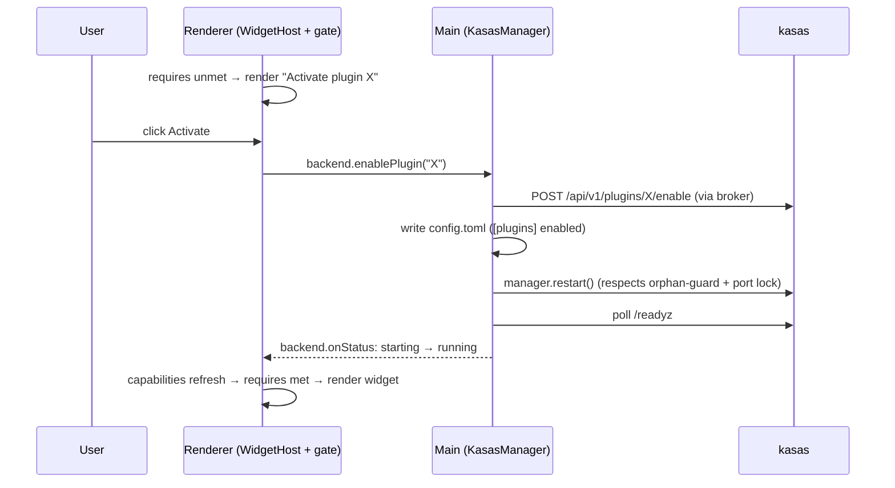

# ADR-0002: Backend-gated widgets — capability detection and plugin activation

- **Status:** Proposed
- **Date:** 2026-06-12
- **Deciders:** Paul Meier
- **Related:** [ADR-0001](0001-user-created-widgets-tiered-model.md) ·
  [ADR-0003](0003-third-party-code-widget-sandboxing.md) ·
  [Managed kasas Backend](../managed-backend.md) ·
  [kasas Integration](../kasas-integration.md) ·
  [Settings & Backend](../../getting-started/settings.md)

## Context and problem statement

Some widgets will need data or behavior the backend doesn't provide out of the box —
a budget projection, an FX-converted total, a category the core ledger doesn't compute.
That capability may live in a **kasas plugin** that has to be enabled, or in a kasas
version newer than the one running. We need a way for a widget to **declare** that it
needs something from the backend, for the app to **detect** whether the backend offers
it, and for the user to **activate** it — without crashing, without silently failing,
and without punching a hole in the [CORS broker](../kasas-integration.md#the-cors-broker).

The honest starting point: **there are zero plugin references anywhere in the Sillview
repo today.** A capability-gated kasas plugin system (enable/disable endpoints,
capabilities, a catalog) was observed in a *separate* `../kasas` checkout — but **not
verified against the kasas binary Sillview actually bundles**. Sillview's main process
currently knows only the *bundled* binary's version (via the updater's `kasas version`
call); the renderer never learns the *running* backend's version or capabilities, and
nothing queries a plugins endpoint. So this ADR must treat kasas extensibility as
**unverified** and design something useful regardless.

## Decision drivers

- **The broker boundary holds.** Even an activated backend plugin's data must flow
  renderer ← main ← kasas. No plugin grants the renderer direct network or filesystem
  reach.
- **Explicit, reversible activation.** Nothing auto-enables. The renderer gains new reach
  only after an explicit user grant, and every activation has a symmetric deactivation.
- **Reuse what main already does.** The main process already manages the binary: writes
  `config.toml`, spawns, polls `/readyz`, restarts, and runs a background LaunchAgent
  (see [Managed kasas Backend](../managed-backend.md)). Activation should drive those,
  not reinvent them.
- **Degrade, never crash.** A widget whose dependency is unmet — or later removed — must
  render an actionable placeholder, reusing ADR-0001's referential-integrity path.
- **Offline-testable.** The whole gate → activate → render → deactivate loop must work
  under `KASAS_MOCK=1`.

## Considered options

### Option A — Try and fail

Let backend-dependent widgets just call their endpoint; show whatever error comes back.

- **Good:** nothing to build.
- **Bad:** a missing capability surfaces as a generic request error, not an actionable
  "enable this." No way to gate the marketplace, no activation path, poor UX, and the
  renderer learns nothing about *why* it failed.

### Option B — Hard-require at build/registration time

Compile backend-dependent widgets out unless a capability is known present.

- **Good:** simple mental model.
- **Bad:** the running backend's capabilities are dynamic (plugins enable/disable, kasas
  updates). A build-time gate can't see them, and `minKasasVersion` is unknowable without
  a running-version probe we don't have.

### Option C — Declare → detect → gate → activate (chosen)

Widgets declare their requirements; the renderer detects backend capabilities through a
shared store; unmet widgets render an actionable gate; activation is an explicit,
main-orchestrated, reversible step.

- **Good:** dynamic, honest about what the backend can do, reuses the manager's existing
  powers, and degrades gracefully. The declaration + detection layers are valuable even
  if kasas turns out not to be extensible yet.
- **Bad:** more moving parts; real activation depends on the unverified kasas plugin API;
  every kind-(a) activation restarts the backend.

## Decision outcome

**Adopt Option C.** Split it so value lands before the risky part: build **declaration +
detection + gating first** (forward-compatible regardless of kasas), and **defer real
activation** until we confirm the bundled binary actually exposes a plugins API.

### Step 1 — Widgets declare requirements

Add an optional `requires` block to `WidgetDefinition` (and to Tier 2 spec manifests):

```ts
// illustrative — not final
interface WidgetRequirements {
  backendCapability?: string;          // a named capability the backend must report
  plugin?: { name: string };           // a kasas plugin that must be enabled
  minKasasVersion?: string;            // semver floor on the RUNNING backend
  endpoints?: string[];                // kasas paths the widget will call
}
```

Today's eight widgets declare nothing and are always available. The dependency rides on
the tile; activation is a separate first-class step.

### Step 2 — Capability detection (how the renderer learns what the backend can do)

- **Surface the *running* backend's version — a hard prerequisite, not optional.**
  Connection testing already calls `GET /api/v1/auth`; extend main to also fetch and
  cache the *running* version (and a `/capabilities` or `/features` endpoint if kasas
  offers one). Without this, `minKasasVersion` gating is unenforceable: the renderer
  knows only the *bundled* version today.
- **List plugins over the existing broker — no new IPC for reads.** A plugins endpoint
  (e.g. `GET /api/v1/plugins`) is just a kasas REST path, and the renderer already has a
  generic broker. Listing is `kasas.request({ method:'GET', path:'/api/v1/plugins' })`,
  exactly like any other call. New `backend.*` IPC channels are justified **only** for
  the write+restart orchestration (`enablePlugin`/`disablePlugin`), which is a genuine
  main-process concern.
- **One shared capability store, read synchronously by the host.** A
  `useBackendCapabilities()` hook keyed on `version + eventNonce` exposes
  `{ version, plugins, capabilities }`. `WidgetHost` reads it synchronously and checks a
  widget's `requires`: met → render; unmet → render the gate placeholder. **Do not**
  `await` a per-tile plugin query inside `WidgetHost` — it is a synchronous render
  function, and a per-tile await would fire one query per widget.

### Step 3 — Two plugin kinds, decided explicitly { #two-plugin-kinds }

| Kind | Where it runs | Activation | Trust |
| --- | --- | --- | --- |
| **(a) kasas-core plugin** | inside kasas | enable over the broker, then write `config.toml` + `manager.restart()` (or LaunchAgent `reload()`) | data still flows renderer ← main ← kasas; no new renderer power |
| **(b) main-side data adapter** | the Sillview **main** process | enable an adapter module + grant it **network egress** | the one deliberate hole in the broker boundary — see below |

Kind (b) is a "backend plugin" that is really a main-process module brokering a *new
external API* (an FX rate, a quote). It never touches kasas. Its egress is the single
deliberate exception to the broker boundary, so it must be **main-process-only and
manifest-allowlisted** (mirroring kasas's own `[net] allow` model) and **never reachable
by a Tier 1/2 user spec.** Different trust story, different activation — keep it a
distinct kind.

**Rule of thumb:** ledger-derived / must run against kasas's DB or events → kind (a);
an external API Sillview can call on its own → kind (b).

### Step 4 — Activation, deactivation, and rollback (symmetric)



- **Marketplace** shows each widget's backend requirement up front
  ("Requires the budget-tracking plugin").
- **Unmet placeholder** renders in-tile with a one-click **Activate** that drives the
  config+restart flow (kind a) or adapter-enable (kind b), with progress reflected in the
  Settings **Status** tab via the existing `backend.onStatus` broadcasts. This is the
  same actionable tile as ADR-0001's referential-integrity case.
- **Deactivation is first-class and symmetric.** Disabling is `POST
  /api/v1/plugins/{id}/disable` and **also requires `manager.restart()`** so hooks unload.
  Crucially, already-placed tiles must **degrade, not crash**: when a plugin a dashboard
  depends on is later disabled, those tiles fall back to the same "Requires plugin X —
  Activate" placeholder via the resolver's missing-dependency path.
- **Restart realities.** Every kind-(a) enable/disable restarts the managed binary.
  Respect the manager's existing [orphan guard](../managed-backend.md#orphan-guard)
  (`pkill` of a stale kasas) and **port mutual-exclusion** (one process on the loopback
  port). An Activate/Deactivate click must never spawn a second kasas; under the
  LaunchAgent it must `reload()`, not spawn a child. Lean on the manager's guards; do not
  open-code spawn logic.
- **Multi-version kasas.** `minKasasVersion` becomes meaningful only once Step 2's
  running-version probe exists. With it, a widget whose floor exceeds the running backend
  degrades to a "needs a newer kasas" placeholder — graceful across backend versions.
- **Offline dev.** Add a `/api/v1/plugins` route and plugin-page fixtures to `mock.ts` so
  the whole gate → activate → render → deactivate loop is testable under `KASAS_MOCK=1`
  (the same mock-coverage discipline ADR-0001 raises for the builder).

### Step 5 — Trust and security

- **Nothing auto-enables.** Main adds a plugin's endpoints to what it will broker only
  *after* the user activates, and removes them on deactivate. The renderer never gains
  reach without an explicit grant.
- **Least privilege + curation/signing**, the way Grafana signs plugins — and explicitly
  *unlike* HACS, whose no-review, full-privilege model produced real CVEs. kasas's own
  capability model (a plugin requests a subset; the operator grants) is the right shape;
  surface the granted capabilities in the Activate dialog so the user sees what they
  approve.

## Consequences

### Positive

- Backend-dependent widgets become possible without weakening the broker boundary.
- Declaration + detection ship value immediately and are forward-compatible whether or
  not kasas is extensible.
- Activation reuses the manager's existing config-write + restart + status machinery.

### Negative / risks

- **Restart fragility.** Every kind-(a) enable *and* disable restarts kasas; bugs risk
  orphaned processes or port contention — mitigated only by leaning on the manager's
  guards.
- **Dependency on an unverified kasas API.** Real activation is blocked on confirming the
  bundled binary exposes a plugins endpoint.
- **Two trust stories.** Kind (b)'s external egress is a deliberate exception that must be
  fenced off from user specs and the renderer.

## Implementation plan

- [ ] **Phase 1 — declaration.** Add `requires` to `WidgetDefinition` and Tier 2
      manifests; today's widgets declare nothing.
- [ ] **Phase 2 — detection + gating** (no activation yet). Running-version probe in main;
      `/api/v1/plugins` read over the broker; `useBackendCapabilities()` store; `WidgetHost`
      gate that renders actionable placeholders. Cheap, forward-compatible.
- [ ] **Phase 3 — confirm kasas extensibility.** Verify the *running* bundled binary
      answers `/api/v1/plugins`. **Gate all of Phase 4 on this.**
- [ ] **Phase 4 — kind-(a) activation.** `backend.enablePlugin`/`disablePlugin` IPC;
      config.toml write + `manager.restart()`; symmetric deactivation; tile degradation
      for already-placed widgets; Settings Status integration; `mock.ts` fixtures.
- [ ] **Phase 5 — kind-(b) adapters.** Main-process adapter framework with a manifest-
      allowlisted egress model; approval UX; fenced off from user specs.

## Open questions

1. **Is the *bundled* kasas actually extensible?** The single most load-bearing unknown.
   A plugin system was seen in a separate checkout, not verified against the shipped
   binary. Until `/api/v1/plugins` responds on the running backend, ship declaration +
   detection and defer kind-(a) activation.
2. **Where does the kind-(b) external-egress allowlist live, and how is it surfaced to
   the user?** It is the one deliberate break in the broker boundary and deserves an
   explicit manifest + approval UX.
3. **What is the capability vocabulary?** Named `backendCapability` strings vs. deriving
   capability purely from enabled plugins + version. Affects how widgets declare needs.

## References

- [Managed kasas Backend](../managed-backend.md) — the lifecycle, config generation, and
  [orphan guard](../managed-backend.md#orphan-guard) activation reuses.
- [kasas Integration](../kasas-integration.md) — the broker and event stream.
- [Settings & Backend](../../getting-started/settings.md) — where activation status
  surfaces.
- [ADR-0001](0001-user-created-widgets-tiered-model.md) — the resolver's missing-
  dependency path this gate reuses.
