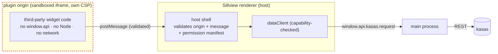

# ADR-0003: Third-party code widgets — the sandbox and trust model

- **Status:** Proposed (deferred — do not build before a proven need)
- **Date:** 2026-06-12
- **Deciders:** Paul Meier
- **Related:** [ADR-0001](0001-user-created-widgets-tiered-model.md) ·
  [ADR-0002](0002-backend-capability-detection-and-plugin-activation.md) ·
  [Architecture Overview](../overview.md) ·
  [Electron security checklist](https://www.electronjs.org/docs/latest/tutorial/security)

## Context and problem statement

[ADR-0001](0001-user-created-widgets-tiered-model.md) defines an altitude ladder for
user-created widgets and commits to staying **declarative** (no user code) as long as
that covers the need — Tiers 0–2. This ADR addresses the ladder's top rung, **Tier 3:
full-code widgets** — arbitrary third-party JavaScript/React, the way Grafana panel
plugins, Home Assistant custom Lovelace cards, and Datadog UI Extensions work.

We write this ADR now, while Tier 3 is deferred, for two reasons. First, so the trade
space is recorded before anyone is tempted to ship third-party code casually. Second, and
more important, because **the conventional Electron advice is wrong for this app**, and
that correction is exactly the kind of thing that is cheap to know now and expensive to
discover during implementation.

The correction: Sillview's renderer is *already* sandboxed — `contextIsolation`,
`sandbox`, and `nodeIntegration: false` are on, and it has **no Node and no direct
network**; it reaches kasas only through `window.api` (see
[Architecture Overview](../overview.md)). So the usual "just render the plugin in an
iframe" instinct buys **nothing**: a *same-origin* iframe inside our renderer inherits the
renderer's `window` and its `window.api` reach. Isolation only exists at an origin or
process boundary.

## Decision drivers

- **The renderer is already the trust boundary we rely on.** Any third-party code must end
  up with *less* reach than our own renderer, never equal.
- **No path to `window.api`, `ipcRenderer`, Node, or the network** for plugin code, ever —
  except a narrow, capability-checked data channel we mediate.
- **Never disable `webSecurity`.** That turns off same-origin policy and is precisely what
  the [broker architecture](../kasas-integration.md#the-cors-broker) exists to avoid.
- **Supply chain is the real threat.** Arbitrary code from a catalog is the attack surface;
  signing, checksums, a declared-permission manifest, and curation are mandatory, not
  optional.
- **It must be honestly heavy.** Tier 3 is a permanent maintenance and security
  commitment. The decision must make that cost visible so we only pay it for a proven need.

## Considered options

### Option A — Same-origin iframe + postMessage — REJECTED

Render the plugin in an iframe within the renderer; talk over `postMessage`.

- **Why rejected:** a same-origin iframe shares the renderer's origin and can reach the
  same globals (`window.api`, `window.opener`, parent DOM). It provides *no* security
  boundary. This is the trap the introduction warns about.

### Option B — `<webview>` tag — REJECTED

Use Electron's `<webview>` to host plugin UI.

- **Why rejected:** `<webview>` is **deprecated and actively discouraged** by Electron
  (unstable API, large attack surface, poor isolation guarantees). Not a foundation to
  build a plugin system on.

### Option C — Cross-origin sandboxed iframe + brokered RPC (chosen for UI)

Serve plugin UI from a **distinct origin** in an `<iframe sandbox>` under its own
restrictive CSP. By construction it has **zero** access to `window.api`. All data access
is a **two-hop RPC**: plugin → validated `postMessage` → host renderer →
`window.api.kasas.request` → main → kasas.

- **Good:** a real boundary; plugin code can never touch `window.api`, Node, or the
  network directly; every data request passes through code we control and can
  capability-check.
- **Bad:** more plumbing (the two-hop RPC, message validation, a hosting origin); a
  versioned SDK contract to maintain; still requires signing + curation on top.

### Option D — `utilityProcess` extension host (for privileged/non-UI work)

For plugins that need to *compute* rather than render — or any privileged/Node work — run
them in a brokered `utilityProcess` (the VS Code extension-host model), never in the
renderer.

- **Good:** strong process isolation; no DOM/`window.api`; communicates over a typed
  channel main mediates.
- **Bad:** heavier still; only warranted for genuine compute/privileged plugins. Most
  visualization plugins are UI and fit Option C.

## Decision outcome

**If and when Tier 3 is built, adopt Option C for plugin UI and Option D for any
privileged/compute plugin.** Reject Options A and B outright. The load-bearing rules:

- **The only real renderer-side boundary is a cross-origin sandboxed iframe** with its own
  CSP. It must talk to the host exclusively over `postMessage`; the host re-brokers to
  main. There is no shortcut where plugin code touches `window.api` directly.
- **The host validates every message** (sender origin + shape) and enforces a **per-plugin
  permission manifest** — which kasas endpoints, which external hosts — before re-brokering.
- **The SDK seam is a versioned widget contract.** A plugin receives `(config, dataClient)`,
  where `dataClient` is a narrow, capability-checked wrapper over the two-hop RPC — never
  raw `ipcRenderer`, never `window.api`.
- **`utilityProcess`, never the renderer,** for any code needing privilege or Node.
- **Never `nodeIntegration`; never disable `webSecurity`.**
- **Supply chain:** signing + checksums + curation, Grafana-style — refuse unsigned by
  default; require an explicit allowlist override to load unsigned. Do **not** ship Tier 3
  as an open, unreviewed store (the HACS cautionary tale).

## Detailed design (when built)

- **Hosting origin.** Plugin bundles are served from an origin distinct from the renderer
  (e.g. a dedicated `app://plugin/<id>` scheme or a loopback origin) so the iframe is
  genuinely cross-origin. The iframe carries `sandbox="allow-scripts"` (no
  `allow-same-origin`) and a CSP that forbids network egress from inside the frame.
- **RPC contract.** A small, versioned message protocol: `request(endpoint, query)` →
  `result | error`, plus lifecycle (`init(config)`, `resize`, `dispose`). The host maps
  `endpoint` through the plugin's permission manifest to a `KasasRequest`, calls
  `window.api.kasas.request`, and returns data — money still a decimal string, formatted
  by the host or by SDK helpers, never re-parsed unsafely.
- **Permission manifest.** Declared in the plugin package: requested kasas endpoints,
  requested external hosts (kind-(b)-style, main-allowlisted —
  [ADR-0002](0002-backend-capability-detection-and-plugin-activation.md#two-plugin-kinds)),
  and capabilities. Surfaced to the user at install/activate; the host enforces it on
  every RPC.
- **Distribution & trust.** A signed package with a checksum; signature verified before
  load; default-deny for unsigned; a curated catalog if sharing is ever offered. Tier 3
  widgets participate in ADR-0001's referential-integrity model — a `dashboards.json` that
  references an uninstalled plugin degrades to an actionable "install plugin X" tile.

## Consequences

### Positive

- Enables genuinely novel visualizations the declarative builder can't express, without
  weakening the renderer's existing isolation.
- The two-hop RPC keeps plugin data access mediated and auditable.

### Negative / risks

- **A permanent security and maintenance commitment:** a stable SDK contract, a signing/
  curation pipeline, an isolation boundary to keep correct across Electron upgrades.
- **The heaviest rung by far.** Most personal-finance dashboards never need it; building it
  prematurely spends scarce risk budget for little gain.
- **Boundary fragility.** A single misconfiguration (same-origin iframe, `allow-same-
  origin`, a relaxed CSP, an unvalidated message) collapses the whole boundary.

## Implementation plan

This ADR is **deferred**. Do not implement until:

- [ ] A concrete visualization need is proven *unmeetable* by the Tier 1–2 declarative
      builder ([ADR-0001](0001-user-created-widgets-tiered-model.md)).
- [ ] The layered registry resolver and referential-integrity degradation (ADR-0001,
      Phase 4) already exist to host plugin types.
- [ ] We have explicitly chosen to accept third-party code (see open questions) and a
      signing/curation model.

When those hold, build in order: cross-origin hosting + sandboxed iframe → validated RPC +
permission manifest → versioned SDK + `dataClient` → signing/verification → catalog.

## Open questions

1. **Do we want third-party *code* at all, or stay declarative-only forever?** Declarative-
   only keeps the entire trust model intact and matches the project's "very vanilla"
   leaning. Choosing it now simplifies everything above and may close this ADR as
   "won't do."
2. **Curated/signed vs open sharing?** The fork with the largest security consequences —
   Grafana-style signed catalog vs. HACS-style open store.
3. **UI-only plugins, or compute plugins too?** Determines whether Option D
   (`utilityProcess`) is in scope at all.

## References

- [Electron security checklist](https://www.electronjs.org/docs/latest/tutorial/security)
  — `contextIsolation`, `sandbox`, never disabling `webSecurity`, avoiding `<webview>`.
- [Architecture Overview](../overview.md) — the renderer isolation this ADR must not
  weaken.
- [ADR-0001](0001-user-created-widgets-tiered-model.md) and
  [ADR-0002](0002-backend-capability-detection-and-plugin-activation.md) — the declarative
  ladder this sits atop and the capability/egress model it reuses.
