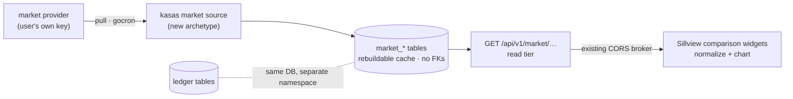

# ADR-0004: External market data — ownership, storage, and access

- **Status:** Proposed
- **Date:** 2026-06-12
- **Deciders:** Paul Meier
- **Related:** [ADR-0001](0001-user-created-widgets-tiered-model.md) ·
  [ADR-0002](0002-backend-capability-detection-and-plugin-activation.md) ·
  [kasas Integration → The CORS broker](../kasas-integration.md#the-cors-broker) ·
  [Widget Catalog](../../features/widgets.md) ·
  [kasas ADR 0006](https://paulmeier.github.io/kasas/architecture/decisions/0006-external-market-reference-data/)
  (the backend half of this decision, in kasas's own ADR log — each repo numbers
  its own; lands with kasas PR #125)

## Context and problem statement

The motivating user story: *"How is my mutual fund doing compared to the S&P 500?"*
Answering it requires data that is not — and never will be — in the user's ledger:
benchmark index levels, fund NAVs, FX rates. Call this **external market/reference
data**: time series about the *world*, as opposed to the ledger's facts about *your
money*.

Today neither side of the system has any of it:

- **kasas** stores organizations, accounts, transactions, labels, extensions, and
  relationships — and nothing else. There is no prices table, no securities/ticker
  model, no FX, no valuation. Amounts are exact decimal strings; each account has a
  single `currency` code and a single latest `balance` + `balance_date`
  (`migrations/sqlite/00001_init.sql`).
- **Sillview** is deliberately thin: a display layer whose renderer can only reach
  kasas through the main-process CORS broker
  ([kasas Integration](../kasas-integration.md#the-cors-broker)). It fetches nothing
  else and stores only dashboards locally.

Meanwhile kasas already owns a complete *ingestion* machine: a `source.Source` /
`Puller` interface with six pull sources (SimpleFIN, Teller, Plaid, Bitcoin,
Ethereum, CSV), a gocron-driven poller with cursors and a serialized sync, a
`sync_log`, an event stream, and per-source runtime credentials
(`internal/source/source.go`, `internal/poller/poller.go`). Its `Archetype` enum
already reserves slots beyond `pull` — `file`, `webhook`, `manual`, `enrichment` —
with a comment that new archetype interfaces "will be added as those archetypes are
built."

Three questions need one coherent answer:

1. **Who owns external data — kasas or Sillview?**
2. **Where does it live?** (The proposal on the table: a second SQLite database,
   independent of the ledger.)
3. **How do widgets mesh it with ledger data**, and could users one day share these
   datasets (a "datashare marketplace")?

## Decision drivers

- **One source of truth, many consumers.** kasas is a headless service with other
  clients than Sillview (API keys, webhooks, rules, plugins). Data only Sillview can
  see is data the rest of the system can't react to.
- **The CORS broker is the security model.** The renderer has no network; everything
  flows through `window.api.kasas.request()`. [ADR-0001](0001-user-created-widgets-tiered-model.md)'s
  entire Tier 1–2 safety story rests on user specs being pinned to *kasas paths,
  never a host*. Any design that puts market data behind a non-kasas API forces a
  second datasource type into the spec model and erodes that invariant.
- **Ledger purity.** The ledger is exact, sourced facts about the user's money.
  World data is a *rebuildable cache* — different provenance, different retention,
  different blast radius. The design must keep them separable even if co-located.
- **Decimal-string discipline.** kasas never floats money; index levels and NAVs get
  the same treatment (a price is money per unit).
- **Licensing reality.** Market data is licensed IP. Personal use of fetched data is
  one thing; *redistribution* is almost universally prohibited — which constrains
  the marketplace idea hard (see [Devil's advocate](#devils-advocate)).
- **"Very vanilla."** Prefer extending existing, conventional machinery (sources,
  poller, migrations, read-tier REST) over inventing parallel infrastructure.
- **Offline dev must keep working.** New endpoints need `KASAS_MOCK=1` coverage.

## Considered options

### Option A — Sillview owns it (main-process adapter + local store)

Fetch quotes in the Electron main process and persist them beside `dashboards.json`
(e.g. a `market.db` in `userData`). This is the route
[ADR-0002's kind (b)](0002-backend-capability-detection-and-plugin-activation.md#two-plugin-kinds)
sketched — it even names "an FX rate, a quote" as examples.

- **Good:** fastest to ship — TypeScript only, no cross-repo coordination, no kasas
  release. The egress-allowlist model is already designed in ADR-0002.
- **Bad:** the data is trapped in the display layer. Headless kasas consumers,
  plugins, webhooks, and rules can never see it. Sillview grows a second ingestion
  engine (scheduler, retry, cursors, credential storage) duplicating what kasas
  already has in Go. The "one deliberate hole" in the broker boundary becomes a
  load-bearing data plane rather than a rare exception. Worst: ADR-0001's
  query-builder specs are pinned to kasas paths — benchmark data behind a Sillview
  API means either specs can't use it or the spec model grows a second datasource
  kind, contaminating the declarative ladder's security story.

### Option B — A kasas plugin fetches it (`net:fetch`)

Use the existing plugin system: a marketplace plugin pulls prices (per-host egress
grants already exist, `00016_add_plugin_net_grants.sql`) on `OnSyncComplete`.

- **Good:** zero core changes; the kasas-plugins registry is a ready distribution
  channel; egress is already capability-gated per host.
- **Bad:** plugins have nowhere to *put* a time series. Their write capabilities are
  `labels:write` / `extensions:write` — both attach to transactions. Stuffing daily
  index closes into transaction extensions is an abuse of the data model, and plugin
  pages render HTML, not queryable series, so widgets couldn't read the result
  cleanly. Making this work means adding plugin-owned storage plus custom data
  endpoints to the SDK — real core work that converges on Option C with extra
  indirection. Revisit if/when the plugin SDK grows durable storage.

### Option C — kasas owns it as a first-class subsystem *(chosen)*

A new **market source** (a new source archetype alongside `pull`), storing series
into a dedicated `market_*` namespace, served by new read-tier endpoints. Sillview
consumes it through the existing broker like any other kasas data.

- **Good:** reuses the poller, cursors, sync_log, events, and credential machinery
  that already exist; every consumer (Sillview, specs, plugins, webhooks, API users)
  sees the same data; the broker boundary stays intact and ADR-0001's "fixed kasas
  endpoint enumeration" simply grows two entries.
- **Bad:** scope creep for a ledger — kasas takes on provider churn, API quotas, and
  key UX forever. Nothing ships until a kasas release lands and Sillview's bundled
  binary updates. Slower first pixel than Option A.

#### Storage sub-decision: separate SQLite file vs separate namespace

The original proposal was a **second SQLite database** independent of the ledger.
Evaluated honestly:

| | C1 · separate `market.db` file | C2 · same DB, `market_*` tables *(chosen)* |
| --- | --- | --- |
| Ledger purity | physical — strongest | logical — by contract (no FKs, wipe command) |
| Wipe/rebuild | delete the file | `kasas market reset` truncates the namespace |
| sqlite ↔ Postgres parity | **broken** — Postgres deployments need a second database or a sqlite sidecar | identical on both dialects (Postgres: same tables, optional schema) |
| Plumbing | second `store.go`, second migration chain, second connection | one migration chain, additive files |
| Cross-source queries | `ATTACH` (sqlite-only) or app-level | app-level joins (the plan anyway) |
| Data volume | a daily series is ~252 rows/year — tiny either way | same |

The independence the separate file buys is real but achievable by **contract** at a
fraction of the plumbing: market tables carry no foreign keys into ledger tables,
are excluded from data exports by default, and are rebuildable from provider +
symbol + date range alone. The separate file's one decisive advantage (physical
purity) doesn't outweigh breaking the dual-dialect store abstraction. **Choose C2**,
and record C1 as the fallback if the cache ever grows write patterns that measurably
hurt the ledger DB (WAL churn, backup time).

## Decision outcome

**Adopt Option C with storage C2.** kasas owns ingestion, storage, and serving of
external market/reference data; Sillview owns visualization and comparison math.
The "datashare marketplace" is **deferred and reframed** as sharing *connectors*,
never data (see Devil's advocate and Follow-up ADRs).



This **narrows ADR-0002's kind (b)**: market/reference data used for analysis must
come through kasas. Kind (b) main-side adapters remain for capabilities that
genuinely cannot live in the backend, but "an FX rate, a quote" is no longer the
canonical example — it is exactly what this ADR routes through kasas instead.

Because the decision spans two repos, it is recorded twice with a clear split of
authority:
[**kasas ADR 0006**](https://paulmeier.github.io/kasas/architecture/decisions/0006-external-market-reference-data/)
is the **canonical record for the backend design** (source archetype, `market_*`
schema, API routes, provider model); *this* ADR is canonical for the
Sillview-side consequences — broker-only consumption, the kind (b) narrowing,
widgets, and mock coverage. The backend sketches below are context, not the
contract; if they drift, kasas ADR 0006 wins.

## Detailed design

### kasas: schema (illustrative)

```sql
-- World facts, not ledger facts: a rebuildable cache. No FKs into ledger tables.
CREATE TABLE market_series (
    id        TEXT PRIMARY KEY,   -- stable internal id, e.g. "sp500tr"
    provider  TEXT NOT NULL,      -- e.g. "stooq" — provider choice is ADR-0005
    symbol    TEXT NOT NULL,      -- provider-native symbol
    kind      TEXT NOT NULL,      -- index | fund | equity | fx | crypto
    currency  TEXT NOT NULL,      -- ISO code values are quoted in
    adjusted  INTEGER NOT NULL,   -- 1 = total-return / split-adjusted series
    meta      TEXT                -- JSON: display name, license note, …
);

CREATE TABLE market_points (
    series_id  TEXT NOT NULL,
    date       TEXT NOT NULL,     -- ISO-8601 date; daily close granularity
    value      TEXT NOT NULL,     -- decimal STRING — same discipline as money
    fetched_at INTEGER NOT NULL,
    PRIMARY KEY (series_id, date)
);
```

Daily closes only. Intraday is an explicit **non-goal**: it multiplies quota cost,
storage, and provider complexity for a personal-finance dashboard that compares
months, not minutes.

### kasas: the market source

- A new archetype (e.g. `ArchetypeReference`) beside `pull`/`enrichment`, with a
  `SeriesPuller` interface — the existing `Puller` returns `ImportBatch`
  (accounts + transactions), which a market source has no business producing.
- One provider behind a small provider interface so the first provider
  (ADR-0005 decides which) isn't load-bearing. API keys go through the existing
  runtime credential machinery, never `config.toml`.
- Config sketch:

  ```toml
  [sources.market]
  provider = "stooq"        # first provider TBD — ADR-0005
  interval = "24h"
  series   = ["^spx", "vtsax"]
  ```

- The poller schedules it like any source; runs land in `sync_log`; completion emits
  an event (so plugins/webhooks can react to fresh prices); the generic
  `POST /api/v1/sources/{type}/sync` gives on-demand refresh for free.

### kasas: API (read tier)

- `GET /api/v1/market/series` → `{ "series": [ … ] }` (named-key wrapping, per
  convention)
- `GET /api/v1/market/series/{id}/points?since=…&until=…` → `{ "points": [ … ] }`

Both readable with the dashboard token, like other read-tier routes.

### Sillview: comparison widgets

- A **Benchmark comparison** widget: pick an account + a series; render "growth of
  $10k" — both lines normalized to 100 at the window start. Pure broker traffic
  (`kasas.request({ path: '/api/v1/market/…' })`): **no new IPC, no new trust
  surface, no renderer egress.**
- Chart copy must be honest: label the series as *price* vs *total-return*, and the
  account line as *balance* (which includes deposits) — see Devil's advocate.
- **ADR-0001 synergy:** the market endpoints join the fixed kasas endpoint
  enumeration, so Tier-1 query-builder specs gain benchmarks with zero changes to
  the spec security model.
- **Mock mode:** `mock.ts` grows `/api/v1/market/*` routes serving a seeded
  synthetic series generated relative to `now` (same pattern as existing fixtures).

## Devil's advocate

The case against — recorded so we walk in clear-eyed.

- **The comparison the user actually asked for cannot be computed honestly yet.**
  An investment account's value moves with the market *between* syncs with no
  transaction; kasas keeps only the **latest** balance. A historical account-value
  series cannot be reconstructed from transactions, so "my fund vs the S&P" is, in
  phase 1, *a benchmark overlay for context* — not performance attribution. Honest
  time-weighted comparison needs balance snapshots (follow-up ADR-0006). Shipping a
  chart that implies more is worse than no chart.
- **Naive overlays mislead by construction, twice.** (1) The S&P 500 most people
  quote (SPX) is a *price* index; a fund balance includes reinvested dividends.
  Comparing them flatters the fund by ~2%/yr compounded — prefer total-return
  series (`adjusted` exists in the schema for this reason) and label which is
  shown. (2) Account balances grow with *deposits*; an account receiving monthly
  contributions "beats" any index. Without flow-adjusted math (ADR-0007) the
  widget must say "balance", never "return".
- **Licensing is a minefield, and it kills the marketplace as proposed.** Index
  levels are licensed IP (S&P DJI); most providers' terms prohibit redistribution
  even of "free" data; unofficial Yahoo endpoints violate ToS outright. A
  marketplace where users **share fetched data** makes the project an unlicensed
  data vendor — and if "datashare" ever meant sharing slices of *personal ledger*
  data, anonymization-by-hand is a re-identification trap. The viable reframe:
  share **connectors** (specs/plugins that fetch from the original source under
  each user's own key) through the existing kasas-plugins registry — datasets as
  code, never as data. That is follow-up ADR-0008, and it is deliberately *not*
  part of this decision.
- **Provider risk is permanent ops burden.** Free tiers are tight
  (Alpha Vantage: ~25 req/day) and providers die (IEX Cloud, 2024). Users must
  bring their own key for anything beyond a keyless default; quotas, backoff, and
  provider migration (symbol remapping across providers) are forever-costs kasas
  is signing up for. Mitigation: provider-agnostic interface, stable internal
  series ids, daily granularity.
- **Scope creep.** kasas's identity is "exact facts from your institutions." This
  ADR makes it also a (small) market-data platform. The fence: kasas stores
  *series the user configured*, full stop — no securities master, no symbol
  search, no fundamentals, no intraday. Each of those would need a new ADR on
  purpose.
- **Cross-repo latency.** Option A would demo in a weekend; Option C needs a kasas
  release plus a Sillview bundled-binary update before the first pixel. Accepted:
  this is infrastructure, and the self-update path already exists.
- **A second egress class.** kasas already calls banks; now it also calls market
  providers — new hosts in the user's threat model (the only leak is ticker
  interest, but it should be visible/allowlisted like plugin `net:fetch` grants,
  not silent).

## Consequences

### Positive

- One copy of the data, visible to every consumer: widgets, query-builder specs,
  plugins, webhooks, rules, and headless API users.
- Sillview's security model is untouched — the renderer still reaches exactly one
  host through one broker, and ADR-0001's spec invariant ("a path, never a host")
  survives unchanged.
- Reuses kasas's ingestion machinery nearly wholesale; the ledger stays pure via
  the no-FK, rebuildable-cache contract.
- Valuation (BTC→USD, EUR→USD) becomes a natural future client of the same tables
  (ADR-0009) instead of a separate system.

### Negative / risks

- kasas permanently owns provider churn, quotas, and key UX (mitigations above).
- The migration chain now carries non-ledger tables; market migrations must stay
  additive and isolated so a bad one can't threaten ledger data.
- The first user-visible comparison is honest-but-modest (overlay, not attribution)
  until ADR-0006/0007 land — expectation management in the widget copy is part of
  the deliverable.
- Mock mode grows synthetic-series maintenance.

## Implementation plan

- [ ] **Phase 1 (kasas):** `market_*` migrations + store methods; `SeriesPuller`
      interface + market source behind a provider interface; poller + `sync_log` +
      event integration; `GET /api/v1/market/*` read routes; `kasas market reset`.
- [ ] **Phase 2 (Sillview):** Benchmark-comparison widget through the existing
      broker; honest labeling (price vs total-return, "balance ≠ return");
      `KASAS_MOCK` routes for `/api/v1/market/*`.
- [ ] **Phase 3:** add the market endpoints to ADR-0001's Tier-1 fixed endpoint
      enumeration so query-builder specs can chart benchmarks.
- [ ] **Phase 4+:** governed by the follow-up ADRs below — notably balance
      snapshots (ADR-0006) before any chart says "return".

## Follow-up ADRs

Each is a separable decision deliberately *not* made here:

- **ADR-0005 · Market-data provider selection, credentials & licensing** — which
  provider(s) ship first (keyless default vs bring-your-own-key), quota/backoff
  policy, ToS review per provider, symbol-mapping strategy across providers.
- **ADR-0006 · Account balance history (snapshots)** — record per-account balance
  at each sync into a history table; the prerequisite for any honest performance
  chart. Possibly extends to a holdings/positions/units model for brokerage
  accounts (units × NAV beats balance snapshots when available).
- **ADR-0007 · Performance & benchmark methodology** — time-weighted vs
  money-weighted return, total-return vs price indices, normalization windows,
  contribution handling; the math that turns "overlay" into "comparison".
- **ADR-0008 · Sharing external-data connectors** — the "datashare marketplace"
  reframed: distribute *connector definitions* (and later widget specs per
  ADR-0001 Tier 2) via the existing kasas-plugins registry with its
  integrity-verification model; explicitly rule out redistributing fetched data
  and sharing personal ledger slices.
- **ADR-0009 · Valuation & currency conversion** — FX/crypto series from the same
  `market_*` infrastructure powering a base-currency view of multi-currency
  net worth; where conversion is computed (kasas vs widget) and how it is labeled.

## Open questions

1. **Which provider first, and is there a keyless default** so the feature works
   out-of-the-box? (Decided in ADR-0005; the provider interface here must not
   prejudge it.)
2. **Should ADR-0006 (balance snapshots) land before Phase 2** so the first
   shipped widget can show a real value-over-time line instead of overlay-only?
   The snapshot table is cheap; the argument for sequencing it first is strong.
3. **Series identity:** are internal ids (`sp500tr`) minted by kasas with
   provider-symbol mapping in `meta`, or are provider symbols the id? Affects
   provider migration later; lean internal-id.
4. **Export/backup posture:** confirmed that `market_*` is excluded from data
   exports by default, or should it be opt-in?

## References

- [kasas ADR 0006 — External market & reference data as a first-class source](https://paulmeier.github.io/kasas/architecture/decisions/0006-external-market-reference-data/)
  — the canonical backend record of this decision.
- kasas ingestion: `internal/source/source.go`, `internal/poller/poller.go`
  (source archetypes, pull/cursor model, sync scheduling).
- kasas schema: `migrations/sqlite/00001_init.sql` (accounts hold one latest
  balance — the snapshot gap), `00016_add_plugin_net_grants.sql` (per-host egress
  grants pattern).
- [ADR-0001](0001-user-created-widgets-tiered-model.md) — the fixed-endpoint
  datasource model that market endpoints slot into.
- [ADR-0002](0002-backend-capability-detection-and-plugin-activation.md) — kind (b)
  external egress, which this ADR narrows.
- [kasas Integration → The CORS broker](../kasas-integration.md#the-cors-broker).
