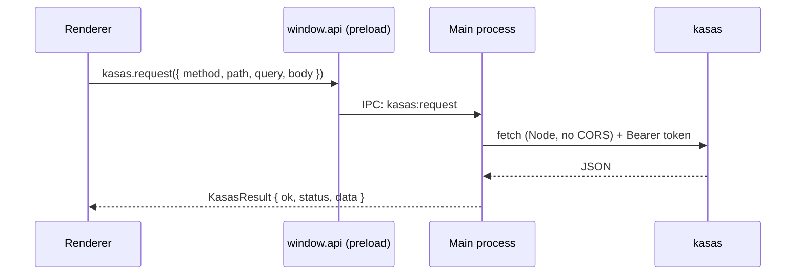

# kasas Integration

Sillview is a front-end for [kasas](https://github.com/paulmeier/kasas). This page
covers the contract between them — why all traffic goes through the main process,
and the data conventions the UI must respect.

## The CORS broker

kasas serves **no CORS headers**. A renderer running on a `localhost` /
`file://` origin therefore *cannot* call `http://127.0.0.1:8080` directly — the
browser blocks it. This is the single most load-bearing constraint in the app.

The fix: **every** kasas REST call and the SSE stream run in the **main**
process, using Node `fetch` (which has no CORS notion), and the renderer reaches
them only through a narrow, validated `window.api`.



!!! danger "Don't 'fix' fetching in the renderer"
    Never move data fetching into the renderer or disable `webSecurity` to dodge
    CORS. The broker is the design, not a workaround. `contextIsolation`,
    `sandbox`, and `nodeIntegration: false` stay on.

### Errors are data

A brokered call returns a `KasasResult` and **never throws across IPC**:

```ts
interface KasasResult<T> {
  ok: boolean;
  status: number;   // HTTP status, or 0 if the request never reached the server
  data?: T;
  error?: string;
}
```

The renderer's typed client and hooks (`src/renderer/api/`) wrap this so widgets
get clean data or a clean error state.

## The live event stream

kasas exposes a canonical change-event stream at `/api/v1/events/stream` (SSE).
The main process consumes it (`src/main/kasas/sse.ts`) and forwards events to the
renderer via `events.onEvent`, with connectivity surfaced through
`events.onStatus`. Widgets like **Live Activity** render straight off this feed;
data hooks re-fetch when relevant events arrive.

## Data conventions

These come straight from kasas's data model and the UI must honor them:

- **Money is a decimal string in major units**, with variable scale — 2 places
  for USD, up to 18 for ETH (8 for BTC). **Never** round it to 2 dp or store it
  as a JavaScript number. Formatting and parsing live in
  `src/renderer/lib/money.ts`; the parse helper is for **sort/sum only**, never
  for display or storage.
- **Timestamps** are ISO-8601 strings.
- **Labels** are a flat `{ key: value }` map.
- **Auth** is `Authorization: Bearer <token>`. In token-less dev kasas runs open;
  in bundled mode Sillview generates and uses a dashboard token automatically.
- List endpoints wrap their arrays under a named key (e.g.
  `{ accounts: [...] }`).

## Local dashboard persistence

kasas deliberately has **no dashboard storage** — it's a ledger, not a UI server.
So Sillview persists dashboards **locally**: the renderer's dashboard store
(zustand `persist`) writes through `dashboards.{load,save}` IPC to a JSON file in
the app's `userData` directory. See
[Dashboards & Widgets](../features/dashboards.md).

## Configuring data sources

Sillview manages the backend process but not (yet) its **sources**. Adding banks
(SimpleFIN), exchange addresses, or CSV imports is done in kasas's own web UI at
`http://127.0.0.1:8080` for now. In-app source configuration is a planned
follow-up. For everything kasas can ingest, see the
[kasas documentation](https://paulmeier.github.io/kasas/).
