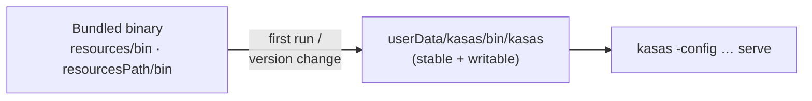

# Managed kasas Backend

Sillview's defining trait is that it **bundles and manages the kasas backend**
instead of asking you to run a server. The kasas binary ships inside the app, and
the main process owns its full lifecycle.

## Why manage it

A desktop app should "just work." Rather than documenting a separate install,
Sillview ships the matching kasas binary, runs it on a private loopback port,
generates its configuration, derives the connection automatically, and can update
it in place. The user never sees a server.

## The bundled binary

The binary ships inside the app via Electron Forge's `extraResource`:

- **Dev:** `resources/bin/kasas` (git-ignored — it's ~48 MB; produced by
  `npm run sync:kasas` or downloaded by `make kasas`).
- **Packaged:** `process.resourcesPath/bin/kasas`.

On first run — and whenever the app version changes — Sillview copies the bundled
binary to a **stable, writable** path under its data directory and marks it `+x`.
Running from a writable location (not the read-only app bundle) is what lets the
LaunchAgent reference it and lets in-place updates work. A `.version` marker next
to the copy tracks which app version installed it.



If no bundled binary is present (e.g. `sync:kasas` was never run in a dev
checkout), the manager reports the binary as missing rather than failing
opaquely.

## File layout

Everything the managed backend needs lives under a `kasas/` subdirectory of the
app's `userData` directory:

| Path | What |
| --- | --- |
| `kasas/bin/kasas` | The runnable binary (copied from the bundle). |
| `kasas/bin/.version` | App version that installed the binary. |
| `kasas/config.toml` | Generated config (overwritten on settings change). |
| `kasas/kasas.db` | SQLite database. |
| `kasas/secrets.json` | kasas-managed source credentials. |
| `kasas/logs/` | Process logs. |

You can open this folder from **Settings → Status → Reveal data directory**.

## Generated configuration

Sillview renders `config.toml` from your [settings](../getting-started/settings.md)
each time they change. It pins SQLite, points the database/secrets at the managed
paths, writes the `[sync]` knobs, enables the dashboard with the generated token,
and — critically — **disables kasas's own self-update**:

```toml
[update]
# A bundled binary must never replace itself — sillview ships updates.
check = false
allow_apply = false
```

Sillview drives [updates](../features/updates.md) explicitly instead; the embedded
backend must never swap its own binary out from under the app.

## Lifecycle

`KasasManager` (`src/main/kasas/manager.ts`) owns the process:

1. **Start** — spawn `kasas -config <cfg> serve`, then poll `/readyz` until the
   server is up.
2. **Run** — stream stdout/stderr into a log buffer (surfaced live in Settings),
   and **auto-restart on crash**.
3. **Stop** — on graceful app quit (`before-quit`) the child is sent `SIGTERM`.

The renderer observes all of this through `backend.onStatus` / `backend.onLog`
and the `KasasStatus` shape (state, PID, ready, base URL, data dir, binary
presence).

### Connection auto-derivation

In **bundled** mode the connection (base URL + a random dashboard token) is
derived from the managed instance — there's nothing to paste. The token is
generated once and **persisted** so it stays stable across launches.
[**External** mode](../getting-started/settings.md#backend) remains available for
pointing at your own kasas.

## Orphan guard

Force-quit, a crash, or dev-time HMR can **orphan** the kasas child. The orphan
keeps holding the loopback port — but with a *stale* token — so the next launch's
event stream gets a `401` and the UI shows "Disconnected."

Two measures prevent this:

- The dashboard **token is persisted** on init, so it's stable across launches.
- On start, the manager runs `pkill -f <managedBinaryPath>` to clear any orphan
  **before** spawning, self-healing the stale-token case.

## Process states

`KasasStatus.state` is one of:

| State | Meaning |
| --- | --- |
| `stopped` | Not running. |
| `starting` | Spawned, waiting on `/readyz`. |
| `running` | Healthy app-managed child. |
| `crashed` | Exited unexpectedly (auto-restart kicks in). |
| `external` | You pointed Sillview at your own kasas URL. |
| `daemon` | Running via the background LaunchAgent, not as our child. |

Background mode swaps the app-managed child for a daemon; the two are mutually
exclusive on the port. See [Background Mode](../features/background-mode.md).
