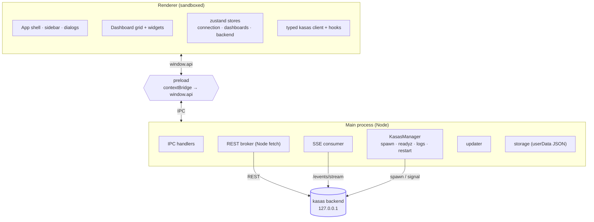

# Architecture Overview

Sillview is an Electron app with the conventional three process boundaries, plus
one distinguishing responsibility: it **manages the kasas backend** as a child
process.



## The three boundaries

| Boundary | File(s) | Responsibility |
| --- | --- | --- |
| **Main** | `src/main.ts`, `src/main/**` | Window + lifecycle + CSP; all kasas traffic; the backend manager; on-disk storage. |
| **Preload** | `src/preload.ts` | Exposes exactly one object, `window.api`, over `contextBridge`. The only renderer↔main link. |
| **Renderer** | `src/renderer/**` | React UI. Talks only to `window.api`; never touches the network or `ipcRenderer`. |

`contextIsolation`, `sandbox`, and `nodeIntegration: false` stay on. The renderer
never sees `ipcRenderer` — only the narrow, typed `window.api` surface declared in
`src/shared/ipc.ts`.

## Source layout

```text
src/
├── main.ts                   # Electron entry: window, CSP, lifecycle
├── main/
│   ├── ipc.ts                # registers IPC handlers; owns connection + stream
│   ├── kasas/
│   │   ├── http.ts           # kasas REST broker (Node fetch — no CORS)
│   │   ├── sse.ts            # /api/v1/events/stream consumer → renderer
│   │   ├── manager.ts        # KasasManager: spawn, /readyz, logs, auto-restart
│   │   ├── paths.ts          # managed file layout + first-run binary copy
│   │   ├── config-toml.ts    # renders kasas config.toml from settings
│   │   ├── launchagent.ts    # macOS LaunchAgent (background mode)
│   │   ├── updater.ts        # drives kasas's self-update CLI
│   │   └── mock.ts           # offline fixtures (KASAS_MOCK=1)
│   └── storage/              # backend-settings.json, connection, dashboards.json
├── preload.ts                # contextBridge → window.api
├── shared/                   # IPC contract (ipc.ts) + kasas DTO types
└── renderer/
    ├── api/                  # typed kasas client (over window.api) + React hooks
    ├── store/                # zustand: connection, dashboards, backend (persisted)
    ├── components/tremor/    # Tremor-style Card + Recharts charts
    ├── widgets/              # widget components + registry.ts (the catalog)
    ├── marketplace/          # MarketplacePanel — browse & add widgets
    ├── dashboard/            # DashboardGrid + WidgetHost + ErrorBoundary
    ├── lib/                  # money, time, utils
    └── App.tsx               # app shell (sidebar, top bar, dialogs)
```

## Two load-bearing decisions

1. **All kasas traffic goes through the main process.** kasas serves no CORS
   headers, so a renderer on a `localhost` / `file://` origin can't call it
   directly. Main performs every REST call and the SSE stream with Node `fetch`
   (no CORS) and exposes a validated `window.api`. See
   [kasas Integration](kasas-integration.md).

2. **Dashboards are saved locally.** kasas has no dashboard storage, so the
   renderer's dashboard store writes through IPC to a JSON file in the app's
   `userData` directory. See [Dashboards & Widgets](../features/dashboards.md).

A third, equally defining trait — Sillview **runs and manages the kasas binary
itself** — is covered in [Managed kasas Backend](managed-backend.md).

## The `window.api` surface

Everything the renderer can do is one object, declared once in
`src/shared/ipc.ts` so main and renderer can't drift:

- `kasas.request(req)` — perform a brokered REST call (errors are returned as
  data, never thrown across IPC).
- `connection.{get,set,test}` — the saved kasas connection.
- `events.{start,stop,onEvent,onStatus}` — the live change-event stream.
- `dashboards.{load,save}` — the persisted dashboards blob.
- `backend.*` — manage the bundled backend: settings, start/stop/restart, status,
  logs, background toggle, reveal data dir, and check/apply updates, plus
  `onStatus` / `onLog` / `onUpdate` subscriptions.
