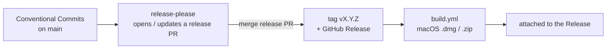

# Releases & CI

Versioning and releases are automated from **Conventional Commit** history by
[release-please](https://github.com/googleapis/release-please) — there is no
manual tag step.

## Conventional Commits

Sillview uses [Conventional Commits](https://www.conventionalcommits.org/). Because
PRs are **squash-merged**, the **PR title** is what counts — it becomes the commit
subject that drives the changelog and the next version.

| Prefix | Effect | Example |
| --- | --- | --- |
| `feat:` | minor bump, "Features" | `feat: add net-worth widget` |
| `fix:` | patch bump, "Bug Fixes" | `fix: stop drag handle eating clicks` |
| `perf:` / `refactor:` / `docs:` | changelog entry | `docs: document mock mode` |
| `test:` / `ci:` / `chore:` | no release | `chore: bump deps` |
| `feat!:` / `fix!:` (or a `BREAKING CHANGE:` footer) | breaking change | `feat!: drop intel build` |

Pre-1.0, breaking changes bump the **minor** version. To cut a specific version
(e.g. the first `1.0.0`), add a `Release-As: 1.0.0` footer to a commit.

## The release flow



1. Land Conventional Commits on `main`.
2. release-please keeps a **release PR** open that bumps `package.json` +
   `CHANGELOG.md`.
3. Merging that PR tags `vMAJOR.MINOR.PATCH` and creates the GitHub Release.
4. CI then builds the macOS `.dmg`/`.zip` and attaches them.

!!! note "Nothing releases until a Conventional Commit lands"
    Pre-existing history isn't conventional, so release-please proposes nothing
    until the first `feat:`/`fix:` lands on `main` (or a `Release-As:` footer is
    used).

## Workflows

Five workflows live in `.github/workflows/`:

| Workflow | Trigger | Does |
| --- | --- | --- |
| **`ci.yml`** | push/PR to `main` | ESLint + typecheck (Node 22). |
| **`codeql.yml`** | push/PR + weekly | CodeQL security/quality scan for JS/TS. |
| **`release-please.yml`** | push to `main` | Maintains the release PR; on merge, tags + Releases, then calls `build.yml`. |
| **`build.yml`** | called by release-please; manual dispatch | Builds the macOS `.dmg`/`.zip` and attaches them. |
| **`docs.yml`** | push to `main` touching docs | Builds this site and deploys it to the `docs` branch. |

`build.yml` is a **reusable workflow**: release-please invokes it (via
`workflow_call`) when a release is created, passing the tag. Running the build in
the *same* workflow run means it fires reliably with the default `GITHUB_TOKEN`;
the optional `RELEASE_PLEASE_TOKEN` PAT only makes the release PR trigger CI.

### How the binary gets there

CI does **not** build kasas from source. `build.yml` downloads the matching
prebuilt binary from the **public** `paulmeier/kasas` GitHub Release, verifies its
SHA-256, drops it at `resources/bin/kasas`, then runs `npm run make`.

## Builds

- macOS builds run on `macos-latest` → **arm64-only and unsigned** today
  (signing/notarization are wired but env-var opt-in; universal/amd64 is a
  follow-up).
- Locally, `make build` produces `out/make/*.dmg` and `*.zip`. Because builds are
  unsigned, first launch needs **right-click → Open**.

## Documentation

This site is **MkDocs Material**. `docs.yml` builds it `--strict` and deploys to
the `docs` branch, which GitHub Pages serves. Preview locally:

```bash
pip install "mkdocs-material==9.7.6"
mkdocs serve     # http://127.0.0.1:8000
```

Source lives in `docs/` and `mkdocs.yml`; edits to either on `main` redeploy
automatically.
