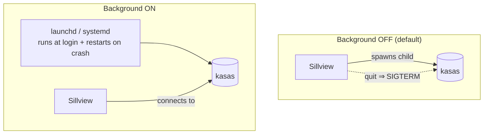

# Background Mode

By default the kasas backend lives and dies with Sillview — it starts when you
open the app and is stopped when you quit. **Background mode** decouples them so
kasas keeps **running and syncing even when Sillview is closed**, keeping your
data fresh.

Toggle it in **Settings → Background**.

## How it works

Background mode registers an OS service that runs just the kasas binary. Sillview
picks the right mechanism for your platform:

- **macOS** — a **LaunchAgent** (`sh.kasas.sillview`) with `RunAtLoad` (starts at
  login) and `KeepAlive` (relaunched if it exits).
- **Linux** — a **systemd user unit** (`kasas-sillview.service`) wanted by
  `default.target` (starts at login) with `Restart=always` (relaunched if it
  exits). Lingering is enabled best-effort so it can also run across logouts.

Either way it runs the same managed binary against the same generated
`config.toml` and data directory as the app-managed child, so the data and
configuration are identical — only *who* supervises the process changes.

(Windows uses a Scheduled Task — a follow-up; until then the Background tab is
hidden there.)

## Mutual exclusion

Only **one** of {app-managed child, background daemon} runs at a time — they'd
otherwise fight over the loopback port. When you enable background mode, the
app-managed child gives way to the daemon; the backend [status](../getting-started/settings.md#status)
then reports the `daemon` state. Disable it and Sillview goes back to supervising
its own child.

On graceful quit Sillview `SIGTERM`s its **own** child but **intentionally leaves
the daemon running** — that's the whole point of background mode.

## When to use it

- **Enable** if you want syncs to keep happening on schedule without opening the
  app — e.g. so data is already current when you next open a dashboard.
- **Leave it off** if you'd rather kasas only run while you're looking at
  Sillview.

The sync cadence is kasas's own `sync.interval`, set in
[Settings → Sync](../getting-started/settings.md#sync).
