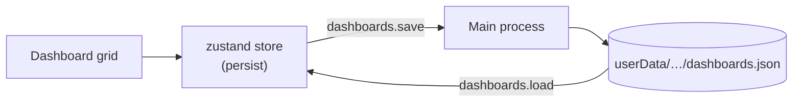

# Dashboards & Widgets

A dashboard is a grid of widgets. You build it from the
[widget catalog](widgets.md), arrange it by dragging and resizing, and Sillview
saves it locally so it's there next launch.

## The grid

The dashboard is a draggable, resizable grid (built on `react-grid-layout`):

- **Drag** a widget by its header to move it.
- **Resize** from the corner handle; each widget declares a minimum size so it
  never collapses below something usable.
- New widgets drop in at the **default size** declared in their catalog entry.

Each widget renders inside a host (`WidgetHost`) wrapped in an **error boundary**,
so one misbehaving widget shows a contained error instead of taking down the
whole dashboard.

## Adding & removing widgets

Open the **marketplace** to browse the [catalog](widgets.md) by category and add a
widget to the current dashboard. Remove a widget from its header menu. The catalog
(`src/renderer/widgets/registry.ts`) is the single source both the marketplace and
the grid read.

## Local persistence

kasas has no dashboard storage, so dashboards are **yours and local**:

- The renderer's dashboard store (zustand with `persist`) holds your layouts.
- It writes through `window.api.dashboards.{load,save}` IPC to a `dashboards.json`
  file in the app's `userData` directory.
- On first run there's nothing to load; once you save a layout it's restored every
  launch.

Because persistence is local, your dashboards are **not** synced across machines —
they live with the app's data on that Mac.

## How widgets get their data

Widgets don't fetch directly. They use the renderer's typed kasas client and
React hooks (`src/renderer/api/`), which call the
[main-process REST broker](../architecture/kasas-integration.md#the-cors-broker)
and re-fetch when relevant
[live events](../architecture/kasas-integration.md#the-live-event-stream) arrive.
Charts are rendered with [Tremor](widgets.md#charts-tremor-style)-style Recharts
components.

To build your own, see [Building a Widget](../development/building-a-widget.md).
