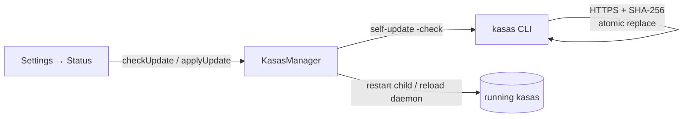

# Backend Updates

Sillview bundles a specific kasas version, but the backend can be **updated in
place** without reinstalling the app. Updates are managed from
**Settings → Status**.

## How it works

Sillview does **not** download binaries itself. Instead it **drives kasas's own
`self-update` CLI**, which performs a verified replacement:

- downloads over **HTTPS**,
- verifies a **SHA-256** checksum,
- and does an **atomic replace** of the binary.

The main-process `updater` shells out to the managed binary's update
subcommands — `version`, `self-update -check`, and `self-update` — and parses
their output into the `KasasUpdateInfo` / `KasasUpdateResult` shapes the UI reads.

After a successful apply, Sillview **restarts** the backend (the app-managed
child, or reloads the daemon in [background mode](background-mode.md)) so the new
version takes over.

## Checking & applying

- **Automatic check on launch** — Sillview checks for a newer release shortly
  after start. The gear shows a **dot** when an update is available.
- **Check now** — re-run the check on demand.
- **Update now** — apply the latest in one click.

The check reports one of: an **available** update (with the latest version and a
release URL), **up to date**, a **dev build** (skipped — not a released version),
or an **error**.

!!! note "The launch check is renderer-driven"
    The on-launch check is initiated by the renderer once its update listener is
    bound — not pushed from main at startup. A main-side broadcast on boot would
    race the renderer subscribing and get missed. (A general lesson for any
    startup push to the UI.)

## Why kasas's own updater?

Because the [managed backend](../architecture/managed-backend.md) runs from a
writable copy of the binary, kasas can replace that copy safely. Sillview
deliberately **disables kasas's internal auto-update** in the generated config
(`update.check = false`, `update.allow_apply = false`) and drives the update
explicitly instead — the embedded backend should never swap itself out from under
the app on its own schedule.
