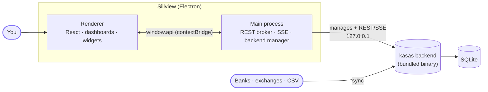

---
hide:
  - navigation
  - toc
---

{ .sill-logo }

# Sillview

A desktop dashboard for your financial ledger.

[Get started :material-rocket-launch:](getting-started/quick-start.md){ .md-button .md-button--primary }
[Architecture :material-sitemap:](architecture/overview.md){ .md-button }
[Download :material-download:](https://github.com/paulmeier/sillview/releases){ .md-button }

Sillview is a **macOS desktop app** that turns the
[**kasas**](https://github.com/paulmeier/kasas) financial ledger into a
dashboard you can actually look at. Build your own dashboards from a
**marketplace of widgets**, arrange them on a **draggable, resizable grid**, and
save them locally.

It is built with **Electron Forge + Vite + React 19 + TypeScript**, styled with
**Tailwind CSS v4**, and visualized with **Tremor**-style charts (Recharts).

The defining trait: Sillview **bundles and manages the kasas backend for you**.
There is no separate server to install or run — on first launch it starts kasas
on a private loopback port, connects automatically, and can even keep it running
in the background and update it in place.

## What you get

-   :material-view-dashboard:{ .lg .middle } __Custom dashboards__

    ---

    Arrange widgets on a draggable, resizable grid. Save as many dashboards as
    you like — they persist locally on your machine.

    [:octicons-arrow-right-24: Dashboards & widgets](features/dashboards.md)

-   :material-shopping:{ .lg .middle } __Widget marketplace__

    ---

    Browse a catalog of widgets by category — net worth, accounts, cash flow,
    spending, live activity — and drop them onto a dashboard.

    [:octicons-arrow-right-24: Widget catalog](features/widgets.md)

-   :material-server:{ .lg .middle } __Managed backend__

    ---

    Sillview ships the kasas binary, copies it to a writable location, generates
    its config, starts it on loopback, and connects automatically. No separate
    server to run.

    [:octicons-arrow-right-24: Managed backend](architecture/managed-backend.md)

-   :material-power-sleep:{ .lg .middle } __Background mode__

    ---

    Opt in to an OS service (macOS LaunchAgent / Linux systemd user unit) that
    keeps kasas syncing even when Sillview is closed — your data stays fresh.

    [:octicons-arrow-right-24: Background mode](features/background-mode.md)

-   :material-update:{ .lg .middle } __In-app backend updates__

    ---

    Sillview drives kasas's own verified self-update (HTTPS + SHA-256 + atomic
    replace) and restarts it — one click, no manual downloads.

    [:octicons-arrow-right-24: Backend updates](features/updates.md)

-   :material-flask:{ .lg .middle } __Offline mock mode__

    ---

    Run the entire UI on in-memory fixtures — no backend, no network, no real
    data. The fastest way to iterate on widgets and layout.

    [:octicons-arrow-right-24: Mock mode](getting-started/mock-mode.md)

## Start here

-   :material-rocket-launch:{ .lg .middle } __Quick Start__

    ---

    Install, build the bundled backend, and launch the app — then add your first
    widgets.

    [:octicons-arrow-right-24: Get started](getting-started/quick-start.md)

-   :material-sitemap:{ .lg .middle } __Architecture__

    ---

    Three process boundaries, the CORS-broker pattern, and how the backend is
    managed — with diagrams.

    [:octicons-arrow-right-24: How it works](architecture/overview.md)

-   :material-puzzle:{ .lg .middle } __Build a widget__

    ---

    A widget is one registry entry plus a component. Read the contract and ship
    your own.

    [:octicons-arrow-right-24: Building a widget](development/building-a-widget.md)

